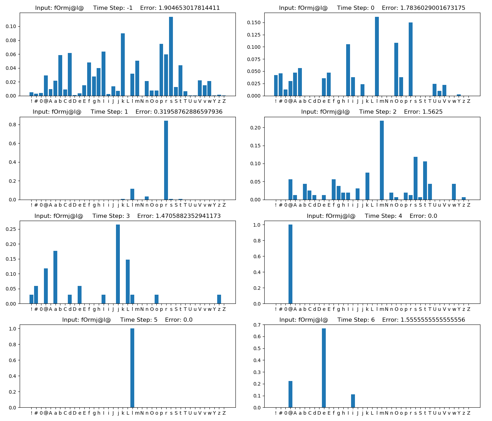
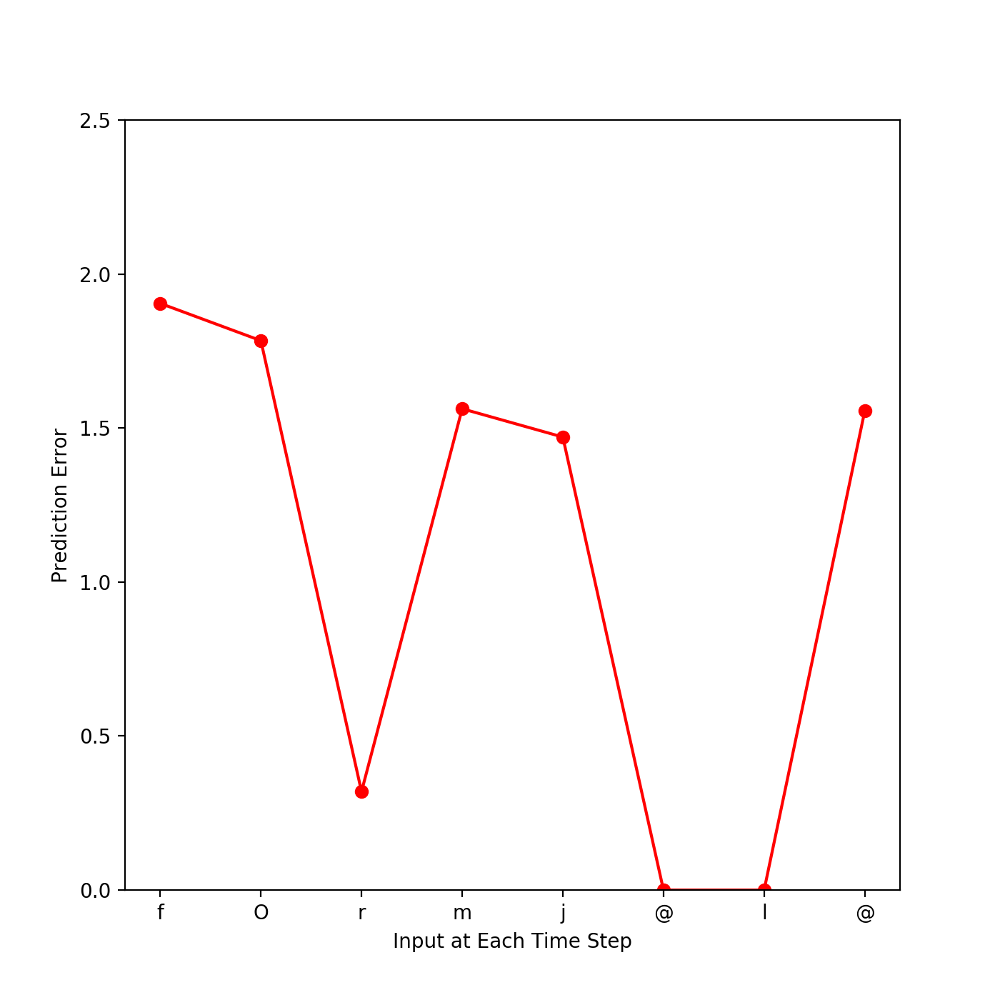

# Gagnepain 2012

```
Gagnepain, P., Henson, R. N., & Davis, M. H. (2012). Temporal predictive codes for spoken words in auditory cortex. Current Biology, 22(7), 615-621.
```

## Method
1. Go to `Gagnepain2012` and run 'ipython'
    ```
    cd Gagnepain2012
    ipython
    ```

2. Import model
    ```
    from Gagnepain2012 import Model
    ```

3. Generate model
    ```    
    new_Model = Model(
        lexicon_File= <path>,
        additional_Lexicon_File= <path>
        )
    ```
        
    * Parameters
        * `lexicon_File`
            * The lexicon that the model uses by default
            * 'ELP_groupData.csv' is an example
        * `additional_Lexicon_File`
            * Lexicon assuming further learning
            * 'Novel_Lexicon.csv' is an example

4. Test
    ```
    new_Model.Test(phoneme_String= <str>)
    ```

    * Result example  
    
    
    