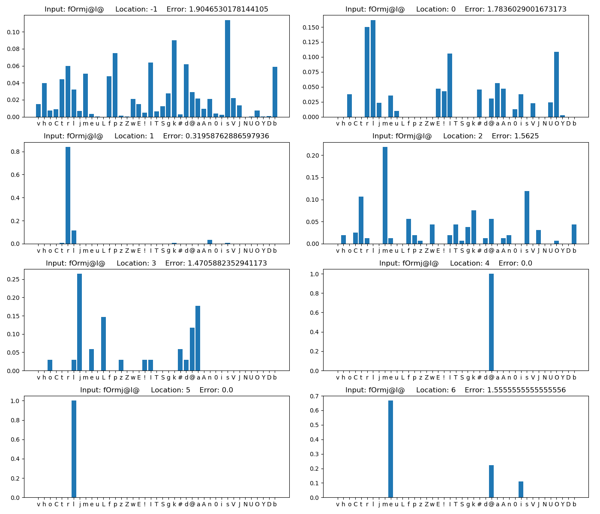
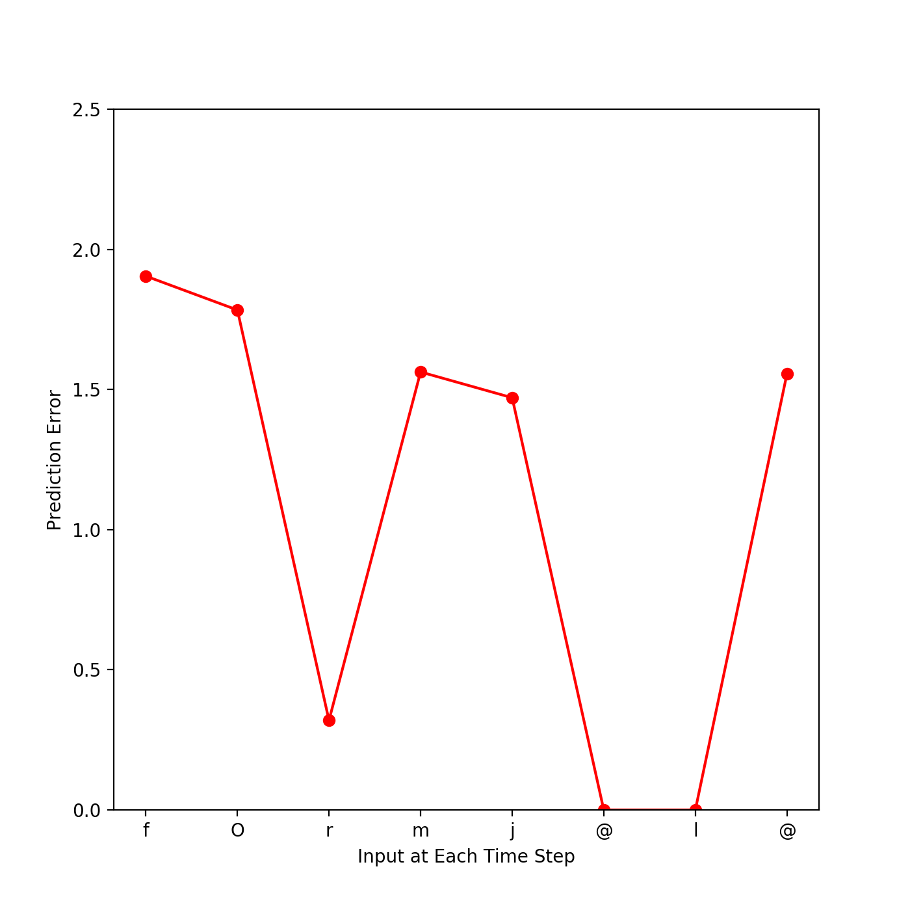
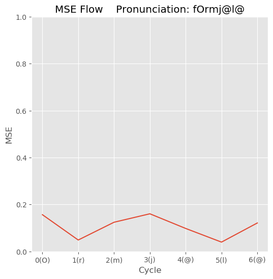

# Predictive_coding
Implementation of several predictive coding models

# Gagnepain 2012

```
Gagnepain, P., Henson, R. N., & Davis, M. H. (2012). Temporal predictive codes for spoken words in auditory cortex. Current Biology, 22(7), 615-621.
```

## Method
1. Go to `Gagnepain2012` and run 'ipython'
    ```
    cd Gagnepain2012
    ipython
    ```

2. Import model
    ```
    from Gagnepain2012 import Model
    ```

3. Generate model
    ```    
    new_Model = Model(
        lexicon_File= <path>,
        additional_Lexicon_File= <path>
        )
    ```
        
    * Parameters
        * `lexicon_File`
            * The lexicon that the model uses by default
            * 'ELP_groupData.csv' is an example
        * `additional_Lexicon_File`
            * Lexicon assuming further learning
            * 'Novel_Lexicon.csv' is an example

4. Test
    ```
    new_Model.Test(phoneme_String= <str>)
    ```

    * Result example  
    
    
        
# SRN

## Method
1. Go to `SRN` and run 'ipython'
    ```
    cd SRN
    ipython
    ```
2. Import model
    ```
    from SRN import Model, Sigmoid, Softmax, List_Test
    ```
3. Generate model
    ```
    new_Model = Model(
        hidden_Unit= <int>,
        output_Function= <Sigmoid or Softmax>,
        lexicon_File= <path>,
        additional_Lexicon_File= <path>,
        weight_File= <path>
        )
    ```

    * Parameters
        * `hidden_Unit`
            * The size of hidden units
        * `output_Function`
            * Determine output function
            * Softmax or Sigmoid
        * `lexicon_File`
            * The lexicon that the model uses by default
            * 'ELP_groupData.csv' is an example
        * `additional_Lexicon_File`
            * Lexicon assuming further learning
            * 'Novel_Lexicon.csv' is an example
        * `weight_File`
            * If you want load a pre-trained weight file, set the weight path
            * If not, set 'None'
    
4. Train basic lexicon
    ```
    new_Model.Train(
        learning_Rate= <float>,
        max_Epoch= <int>,
        epoch_Batch_Size= <int>,
        mode='Normal',
        test_Pronunciation = <str>
        )
    ```

    * Parameters
        * `learning_Rate`
            * The learning rate while training.
        * `max_Epoch`
            * Determine the maximum training epoch.
        * `epoch_Batch_Size`
            * Determine the batch size of training.
            * After doing batch training, the weight will be saved.
        * `mode`
            * In basic lexicon training, this parameter is fixed 'Normal'
        * `test_Pronunciation`
            * Determine one phoneme string will be tested While training.

5. Train additional lexicion
    ```
    new_Model.Train(
        learning_Rate= <float>,
        max_Epoch= <int>,
        epoch_Batch_Size= <int>,
        mode='Addition',
        test_Pronunciation = <str>
        )
    ```
    
    * Parameters
        * `learning_Rate`
            * The learning rate while training.
            * Lower value than basic lexicon training's is recommended.
        * `max_Epoch`
            * Determine the maximum training epoch.
        * `epoch_Batch_Size`
            * Determine the batch size of training.
            * After doing batch training, the weight will be saved.
        * `mode`
            * In basic lexicon training, this parameter is fixed 'Addition'
        * `test_Pronunciation`
            * Determine a phoneme string will be tested While training.

6. Single phoneme string test
    1. Load both of two pre and post addition models.
        ```
        pre_Model = Model(
            hidden_Unit= <int>,
            output_Function= <Sigmoid or Softmax>,
            lexicon_File= <path>,
            additional_Lexicon_File= <path>,
            weight_File= <path>
            )    

        post_Model = Model(
            hidden_Unit= <int>,
            output_Function= <Sigmoid or Softmax>,
            lexicon_File= <path>,
            additional_Lexicon_File= <path>,
            weight_File= <path>
            )
        ```

        * `weight_File` is located in './Result/Weight'

    2. Test
        ```
        pre_Model.Test(pronunciation= <str>, file_Suffix=<str>)
        post_Model.Test(pronunciation= <str>, file_Suffix=<str>)
        ```

        * Parameters
            * `test_Pronunciation`
                * Determine a phoneme string will be tested.
            * `file_Suffix`
                * Determine the suffix of exported file name

    * Result example  
    
    


7. Phoneme string list test
    1. Load both of two pre and post addition models.
        ```
        pre_Model = Model(
            hidden_Unit= <int>,
            output_Function= <Sigmoid or Softmax>,
            lexicon_File= <path>,
            additional_Lexicon_File= <path>,
            weight_File= <path>
            )    

        post_Model = Model(
            hidden_Unit= <int>,
            output_Function= <Sigmoid or Softmax>,
            lexicon_File= <path>,
            additional_Lexicon_File= <path>,
            weight_File= <path>
            )
        ```

        * `weight_File` is located in './Result/Weight'

    2. Type following command
        ```
        List_Test(
            pre_Model= pre_Model,
            post_Model= post_Model,
            phoneme_List= <list of str>
            )
        ```

        * `phoneme_List`
            * The list of phoneme string which you want to test

        * Result file is `'./Result/Result_Data.txt'`.
